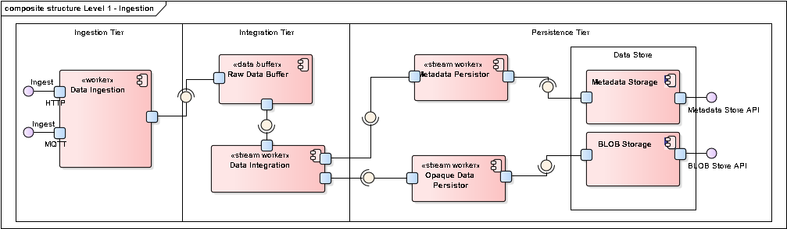

Building Block View
===================

Whitebox Overall System
-----------------------

Motivation

:   *&lt;text explanation&gt;*

Contained Building Blocks

:   *&lt;Description of contained building block (black boxes)&gt;*

Important Interfaces

:   *&lt;Description of important interfaces&gt;*

Insert your explanations of black boxes from level 1:

If you use tabular form you will only describe your black boxes with
name and responsibility according to the following schema:

+----------------------+----------------------------------------------+
| **Name**             | **Responsibility**                           |
+======================+==============================================+
| *&lt;black box       |  *&lt;Text&gt;*                              |
| 1&gt;*               |                                              |
+----------------------+----------------------------------------------+
| *&lt;black box       |  *&lt;Text&gt;*                              |
| 2&gt;*               |                                              |
+----------------------+----------------------------------------------+

If you use a list of black box descriptions then you fill in a separate
black box template for every important building block . Its headline is
the name of the black box.

### &lt;Name black box 1&gt;

Here you describe &lt;black box 1&gt; according the the following black
box template:

-   Purpose/Responsibility

-   Interface(s), when they are not extracted as separate paragraphs.
    This interfaces may include qualities and performance
    characteristics.

-   (Optional) Quality-/Performance characteristics of the black box,
    e.g.availability, run time behavior, ….

-   (Optional) directory/file location

-   (Optional) Fulfilled requirements (if you need traceability to
    requirements).

-   (Optional) Open issues/problems/risks

*&lt;Purpose/Responsibility&gt;*

*&lt;Interface(s)&gt;*

*&lt;(Optional) Quality/Performance Characteristics&gt;*

*&lt;(Optional) Directory/File Location&gt;*

*&lt;(Optional) Fulfilled Requirements&gt;*

*&lt;(optional) Open Issues/Problems/Risks&gt;*

### &lt;Name black box 2&gt; {#__name_black_box_2}

*&lt;black box template&gt;*

### &lt;Name black box n&gt; {#__name_black_box_n}

*&lt;black box template&gt;*

### &lt;Name interface 1&gt; {#__name_interface_1}

…

### &lt;Name interface m&gt; {#__name_interface_m}

Level 2
-------

Here you can specify the inner structure of (some) building blocks from
level 1 as white boxes.

You have to decide which building blocks of your system are important
enough to justify such a detailed description. Please prefer relevance
over completeness. Specify important, surprising, risky, complex or
volatile building blocks. Leave out normal, simple, boring or
standardized parts of your system

### White Box *&lt;building block 1&gt;* {#_white_box_emphasis_building_block_1_emphasis}

…describes the internal structure of *building block 1*.

*&lt;white box template&gt;*

### White Box *&lt;building block 2&gt;* {#_white_box_emphasis_building_block_2_emphasis}

*&lt;white box template&gt;*

…

### White Box *&lt;building block m&gt;* {#_white_box_emphasis_building_block_m_emphasis}

*&lt;white box template&gt;*

Level 3
-------

Here you can specify the inner structure of (some) building blocks from
level 2 as white boxes.

When you need more detailed levels of your architecture please copy this
part of arc42 for additional levels.

### White Box &lt;\_building block x.1\_&gt; {#_white_box_building_block_x_1}

Specifies the internal structure of *building block x.1*.

*&lt;white box template&gt;*

### White Box &lt;\_building block x.2\_&gt; {#_white_box_building_block_x_2}

*&lt;white box template&gt;*

### White Box &lt;\_building block y.1\_&gt; {#_white_box_building_block_y_1}

*&lt;white box template&gt;*

